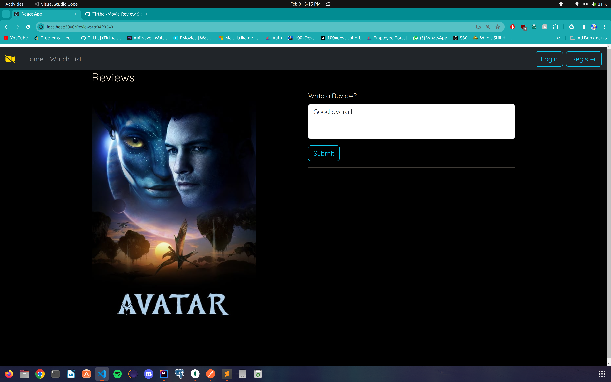

This is my attempt at creating a interactive Full-Stack Movie Review Site, which using React.js, HTML, CSS for my frontend, and Java Spring and MongoDB for my backend. Planning to add more features to this project soon!

The Backend successfully performs all CRUD operations with the data stored in the MongoDB Database. 
The Frontend implements a interactive sliding movie design, and also links the trailer to each movie, and gives the option to write their own reviews to the movies. They also have the option to view other reviews for the movie they want.

Review Section for the webpage

Home Page

Movie Trailer Page
